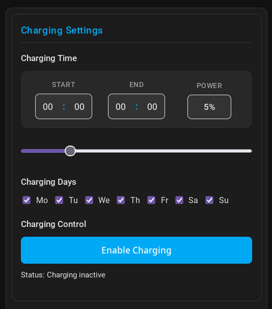
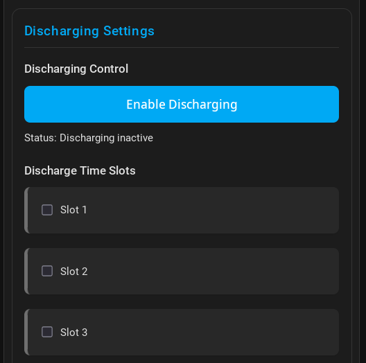

# SAJ H2 Charge/Discharge Card

A custom card for Home Assistant to control charging/discharging settings for SAJ H2 inverters.

This card needs the SAJ H2 Modbus Integration

https://github.com/stanus74/home-assistant-saj-h2-modbus

## Features

- Easy setting of charge start and end time
- Slider for adjusting charging power (0-25%)
- User-friendly selection of charging days with checkboxes
- Display of the calculated daymask value
- Button to enable/disable charging
- Status display for the charging state

## Installation

1. Upload the file `saj-h2-charge-card.js` (https://github.com/stanus74/saj-h2-lovelace-card/blob/main/saj-h2-inverter-card.js) to the directory `/config/www/` of your Home Assistant installation.
   Use HA File Editor. If you dont have, first install the Editor https://youtu.be/lKDcnfaX7O8?si=2V6D7CwBCwCr5QsI&t=195

2. Add the resource to your Lovelace configuration:

   - go to Settings > Dashboards > right upper corner tree dots > Ressources > rigth uper "Add ressources" 
     Path: /local/saj-h2-inverter-card.js
      
     **after added, press Strg+Shift+R to make hard browser refresh**


## Example Configuration

### Charging and Discharging Card
   ```yaml
title: SAJ H2 Inverter Control
type: custom:saj-h2-inverter-card
mode: both #charge or discharge
   ```

 **after added, press Strg+Shift+R to make hard browser refresh**

## Screenshots

**Charge Card:**



**Discharge Card:**



## Troubleshooting

If the card is not displayed correctly or errors occur:

1. Check if the JavaScript file was correctly copied to the `/config/www/` directory.
2. Make sure the resource was correctly added to your Lovelace configuration.
3. Check if all required entity IDs are correctly specified in the configuration.
4. Check the browser console for JavaScript errors.
